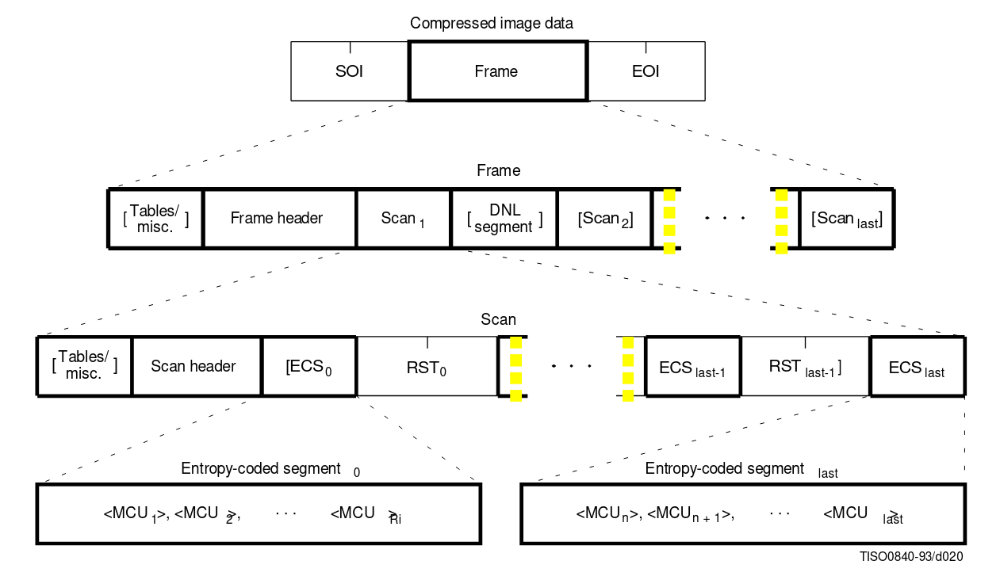
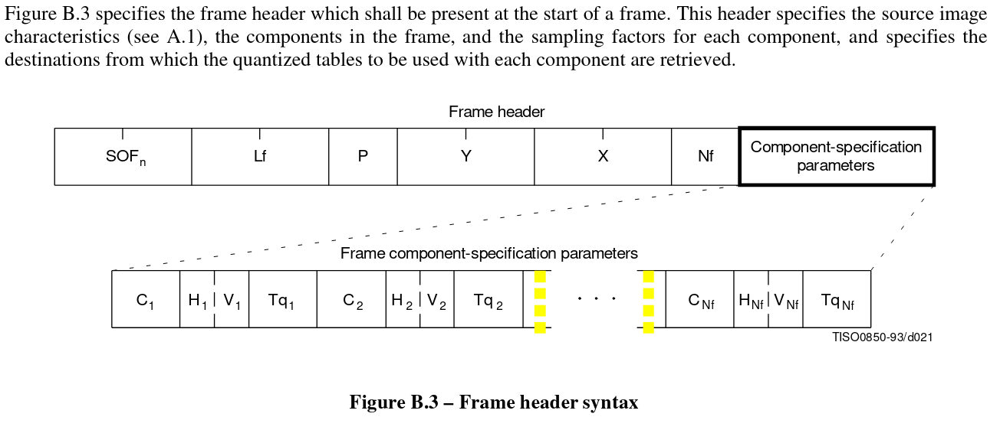
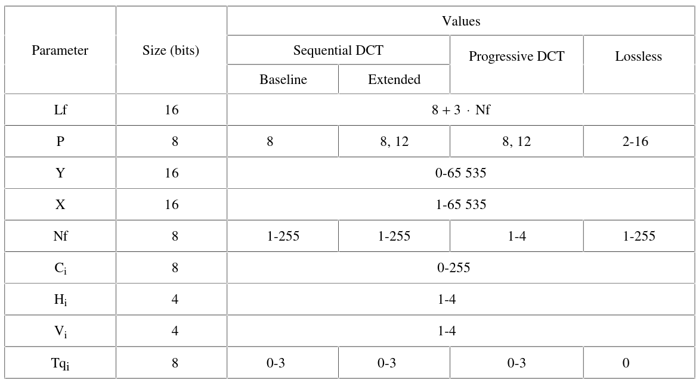
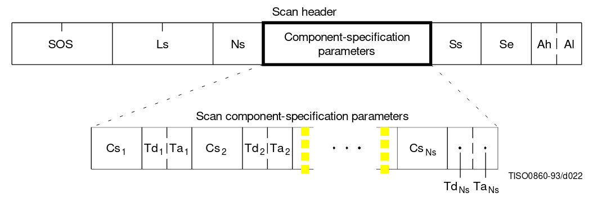
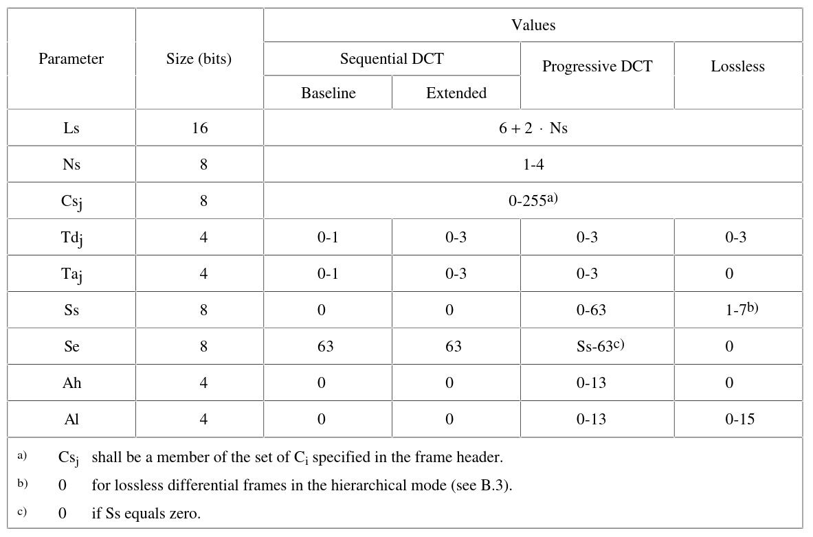
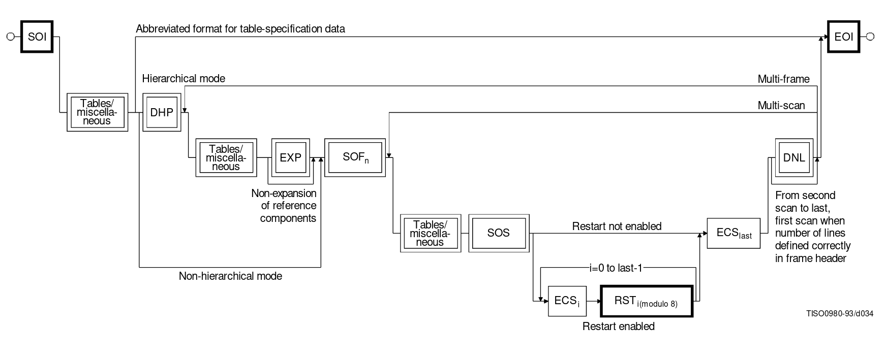

# JPEG FIle Encoding *(...simplified)*
> Might contain minor inaccuracies...

[JPEG specification as reference.](https://www.w3.org/Graphics/JPEG/itu-t81.pdf)

## DCT-based coding

`8x8 blocks -> FDCT -> Quantizer -> Entropy encoder`

| Symbol | Description                                                       |
| ------ | ----------------------------------------------------------------- |
| FDCT   | *forward* DCT. Transforms 8x8 blocks into 64 DCT coeffients.      |
| DC     | DC coeffient. The first value in a block of DCT coeffients.       |
| AC     | Remaining 63 values in DCT coeffient block.                       |
| DIFF   | Difference between the current DC coefficient and the prediction. |

### Encoding process

1. Each component the source image is split into 8x8 blocks.
2. Each block is transformed into DCT coefficients by a *forward discrete cosine transform* (FDCT).
3. DC and AC coefficients are prepared for entropy encoding. DC coeffients are encoded as the difference betweeen it and the previous DC coefficient. AC coefficients are serialized in a zig-zag pattern.
4. The coefficients are then passed on to either a Huffman encoder or an arithmetic encoder. For Huffman encoding, tables has to be provided for the encoder.

> There are four different modes of operation: sequential DCT-based, progressive DCT-based, lossless, & hierarchical. <br/>
> Sequential is the simple one in which entropy encoding can be applied directly to coefficients after preparation.

### General sequential and progressive syntax

#### High-level syntax

*Syntax for sequential DCT-based, progressive DCT-based, and lossless modes:*



| Marker | Description                                                               |
| ------ | ------------------------------------------------------------------------- |
| SOI    | Start of image.                                                           |
| EOI    | End of image.                                                             |
| RST~m~ | Restart marker. Set between entropy-coded segments if restart is enabled. |

#### Frame header syntax



| Marker  | Description                                                                         |
| ------- | ----------------------------------------------------------------------------------- |
| SOF~n~  | Start of frame. *n* signifies encoding mode and which entropy encoding is used.     |
| SOF~0~  | Baseline DCT.                                                                       |
| SOF~1~  | Extended sequential DCT, Huffman coding.                                            |
| SOF~2~  | Progressive DCT, Huffman coding.                                                    |
| SOF~3~  | Lossless (sequential), Huffman coding.                                              |
| SOF~9~  | Extended sequential DCT, arithmetic coding.                                         |
| SOF~10~ | Progressive DCT, arithmetic coding.                                                 |
| SOF~11~ | Lossless (sequential), arithmetic coding.                                           |
| Lf      | Frame header length.                                                                |
| P       | Sample precision. Specifies precision in bits for the frame component samples.      |
| Y       | Number of lines. Specifies maximum number of lines in source image.                 |
| X       | Number of samples per line.                                                         |
| Nf      | Number of image components in frame.                                                |
| C~i~    | Component identifier.                                                               |
| H~i~    | Horizontal sampling factor.                                                         |
| V~i~    | Vertical sampling factor.                                                           |
| Tq~i~   | Quantization table destination selector. Specifies destination of q-table for C~i~. |

*Frame header parameter sizes and values:*



#### Scan header syntax



| Marker | Description                                                                                        |
| ------ | -------------------------------------------------------------------------------------------------- |
| SOS    | Start of scan.                                                                                     |
| Ls     | Scan header length.                                                                                |
| Ns     | Number of image components in scan.                                                                |
| Cs~j~  | Scan component selector.                                                                           |
| Td~j~  | DC entropy coding table destination selector.                                                      |
| Ta~j~  | AC entropy coding table destination selector.                                                      |
| Ss     | Start of spectral or predictor selector. Set to zero for sequential DCT processes.                 |
| Se     | End of spectral selection.                                                                         |
| Ah     | Successive approximation bit position high. Set to zero in lossless.                               |
| Al     | Successive approximation bit position low or point form transform. Point of transform in DCT based |

> If Ns > 1, the image components in scan has the restriction:
> $$\sum^{N_s}_{j=1} H_j \times V_j \leq 10,$$
> where $H_j$ and $V_j$ are the horizontal and vertical sampling factors for scan component j.


*Scan header parameter size and values:*



#### Table-specification and mescellaneous marker segment syntax.
...
#### Quantization table-specification syntax
...
#### Huffman table-specification syntax
...
#### Restart interval definition syntax
...
#### Comment syntax
...
#### Application data syntax
...
#### Define number of lines syntax
...

#### Abbreviated format for compressed image data

Compressed image data missing any table data required for decoding has the abbreviated format.

#### Abbreviated format for table specification data
...

#### Flow of compressed data syntax



<br/>

### Structure of DC code table

The DC code table is a set of Huffman codes (width a max length of 16 bits) and appended additional bits which encodes any possible value of DIFF.

Huffman codes for the difference categories always consists of more than 1-bit.

The two's complement difference magnitudes are grouped into 12 categories, SSSS, and a Huffman code is created for each category.

> For each category, except SSSS = 0, an additional bits field is appended to the code word to uniquely identify which difference in that category actually occurred.
> The number of extra bits is given by SSSS; the extra bits are appended to the LSB of the preceding Huffman code, most significant bit first.
> When DIFF is positive, the SSSS low order bits of DIFF are appended. When DIFF is negative, the SSSS low order bits of (DIFF – 1) are appended.
> Note that the most significant bit of the appended bit sequence is 0 for negative differences and 1 for positive differences.
> (p.88)

*Magnitude categories for DC coding:*

| SSSS  |       DIFF values        |
| :---: | :----------------------: |
|   0   |            0             |
|   1   |          –1, 1           |
|   2   |       –3, –2, 2, 3       |
|   3   |       –7..–4, 4..7       |
|   4   |      –15..–8, 8..15      |
|   5   |     –31..–16, 16..31     |
|   6   |     –63..–32, 32..63     |
|   7   |    –127..–64, 64..127    |
|   8   |   –255..–128, 128..255   |
|   9   |   –511..–256, 256..511   |
|  10   |  –1023..–512, 512..1023  |
|  11   | –2047..–1024, 1024..2047 |

### Convert Huffman table specs to tables of codes and lengths

| Symbol     | Description                                                             |
| ---------- | ----------------------------------------------------------------------- |
| BITS       | List of bits from 1 to 16, containing the number of codes of each size. |
| HUFFVAL    | List of symbol values associated with codes.                            |
| HUFFSIZE   | A list of code lengths.                                                 |
| HUFFCODE   | Huffman code table, containing a code for each size in HUFFSIZE         |
| LASTK      | Index of the last entry in the table.                                   |
| SLL CODE 1 | Indicates a **shift-left-logical** of CODE by one bit position.         |
| EHUFCO     | Huffman code table for encoder                                          |  |
| EHUFSI     | Encoder table of Huffman code sizes.                                    |  |

*Generation of table of Huffman code sizes:*

```
Generate_size_table(K := 0, I := 1, J := 1):

    if J > BITS(I):
        I := I + 1
        J := 1

        if I > 16:
            HUFFSIZE(K) := 0
            LASTK := K
            // Done

        else:
            Generate_size_table(K, I, J)

    else:
        HUFFSIZE(K) := I

        K := K + 1
        J := J + 1

        Generate_size_table(K, I, J)
```

*Generation of table of Huffman codes:*

```
Generate_code_table(K := 0, CODE := 0, SI = HUFFSIZE(0)):
    HUFFCODE(K) := CODE
    CODE := CODE + 1
    K := K + 1

    if HUFFSIZE(K) != 0:
        loop:
            CODE := SLL CODE 1
            SI = SI + 1

            if HUFFSIZE(K) = SI:
                break

        if HUFFSIZE(K) = SI:
            Generate_code_table(K, CODE, SI)

    // Done
```

*Ordering procedure for encoding procedure code tables:*

```
Order_codes(K := 0):
    I := HUFFVAL(K)
    EHUFCO(I) := HUFFCODE(K)
    EHUFSI(I) := HUFFSIZE(K)
    K := K + 1

    if K < LASTK:
        Order_codes(K)

    // Done
```

*Huffman encoding procedure for DIFF:*

**XHUFCO** and **XHUFSI** are a set of extended tables containing the complete set of Huffman codes and sizes for all possible difference values.

**XHUFCO** and **XHUFSI** are generated from the encoder tables **EHUFCO** and **EHUFSI** by appending the Huffman codes for each difference category the additional bits defining the difference.

...

```
SIZE = XHUFSI(DIFF)

CODE = XHUFCO(DIFF)

code SIZE bits of CODE
```

#### Bit ordering within bytes

> The root of a Huffman code is placed toward the MSB (most-significant-bit) of the byte, and successive bits are placed inthe  direction  MSB  to  LSB  (least-significant-bit)  of  the  byte.  Remaining  bits,  if  any,  go  into  the  next  byte  following  thesame rules. <br/>
> Integers associated with Huffman codes are appended with the MSB adjacent to the LSB of the preceding Huffman code. <br/>
> <br/>
> \- C.3, p.53 of CCIT Rec. T.81 (1992 E)

### Encoder control procedures

```
Encode_image():
    Append SOI marker

    Encode_frame()

    Append EOI marker

    // Done
```

```
Encode_frame():
    [Append tables/miscellaneous]
    Append SOF_n marker and rest of frame header

    while More scans:
        Encode_scan()

        if First scan:
            [Append DNL segment]

    // Done
```

```
Encode_scan():
    [Append tables/miscellaneous]
    Append SOS marker and rest of scan header
    m := 0

    Encode_restart_interval()

    while More intervals:
        Append RST_m marker
        m := (m + 1) AND 7

        Encode_restart_interval()

    // Done
```

```
Encode_restart_interval():
    Reset_encoder()

    while More MCU:
        Encode_MCU()

    Prepare_for_marker()

    // Done
```

> Procedure **Reset_encoder**:<br/>
> set DC prediction (PRED) to zero for all components in the scan if process is DCT-based.

> Procedure **Prepare_for_marker** terminates entropy-coded segment by:
> padding a Huffman entropy-coded segment with 1-bits to complete the final byte (and stuffs a zero byte if needed).

```
Encode_MCU(N := 0):
    N := N + 1
    Encode data unit

    if N != Nb:
        Encode_MCU(N)

    // Done
```
